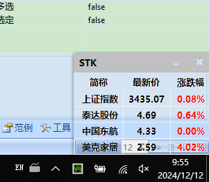

# STK

#### 介绍
STK小智慧，股票盯盘、看盘软件，小工具，非常的小，方便上班时顺便关注一下股票。用aardio做的。自己随便做的，自用。请勿用于商业用途，仅供学习交流使用。

#### 使用说明
软件只有几百K的大小，Windows环境下直接运行即可。  
1.  **软件截图**  
  
  

2.  **透明效果截图**  
  
  

#### 其他
1.  有需求、新建议的留言，我看到后处理。
2.  有定制需求的私信我，免费！嘿嘿。
